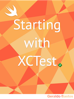

# Starting with XCTest / Iniciando com XCTest

--- 

# Author

You can find more information about me on social networks:

If you have questions, you can find me on Twitter [@geraldobastos](http://twitter.com/geraldobastos).

> If you don't have this ebook, click [here](http://gum.co/XCTest).

---

* <a href="#pt-br">Versão em Português.</a>
* <a href="#eng">English Version - will come soon.</a>

<h1 id="pt-br">Iniciando com XCTest</h1>

Este repositório é um complemento do livro [Iniciando com XCTest](https://gum.co/XCTest) usando Swift para iOS. Cada projeto irá lhe auxiliar a entender melhor o processo de criação dos testes utilizando o framework **XCTest**.

Este livro está disponível na loja [Gumroad](http://gumroad.com) a mesma utilizada nos produtos do famoso site NSHipster.

<h1 id="eng">Starting with XCTest</h1>

### The version English will come soon

This repository is a complement of the ebook [Starting with XCTest](http://gum.co/XCTest) using Swift for iOS. Each project will help you to understand better the process of creating tests with **XCTest** framework. 

This ebook is now available on [Gumroad](https://gumroad.com) the same store that you can find the products of famous site NSHipster.

