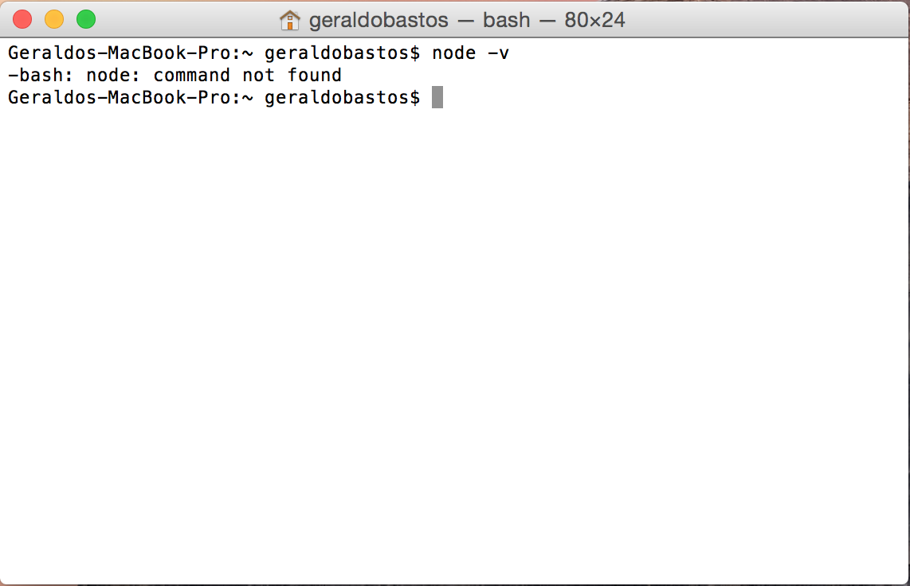
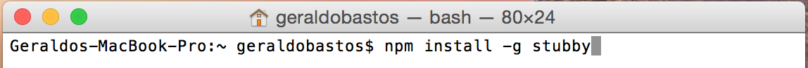

#Configurando o Ambiente
Precisamos preparar o ambiente de desenvolvimento para realizarmos
alguns testes desse artigo, para isso, basta seguir os passos descritos
abaixo:


###Passo 1

Execute o seguinte comando em seu terminal:
	node -v

A palavra node é o comando do nodejs e –v ou --version irá exibir a
versão instalada em sua máquina, caso não possua-o, irá receber a
seguinte mensagem: 

	-bash: node: command not found




Você precisará instalar primeiramente o **nodejs**, pule para o [passo 2](#passo2). Caso a mensagem que você tenha recebido após executar o comando tenha sido
diferente da imagem acima, indicando a versão do nodejs, você pode pular para
o [passo 3](#passo3).

###Passo 2
Acesse o site do [nodejs](http://nodejs.org) e clique no botão de download que fica na página principal ou acesse a área específica para [downloads](http://nodejs.org/download/) e escolha a melhor opcão de acordo com seu Mac. Após a instalação, volte para o [passo 1](#passo1).


###Passo 3

Vamos executar o comando abaixo via [npm](http://npmjs.com). Usaremos o [stubby4node](https://www.npmjs.com/package/stubby#starting-the-servers), para criarmos stubs de nossos serviços e testarmos as integrações.

Se for necessário, execute com o comando **sudo**, caso você tenha algum
problema de permissão no Mac. Após a instalação, execute o comando:


	stubby –v

	
O terminal deverá mostrar a versão do stubby. Conseguindo executar todas as etapas com sucesso, nós já podemos iniciar a avaliação do código.
